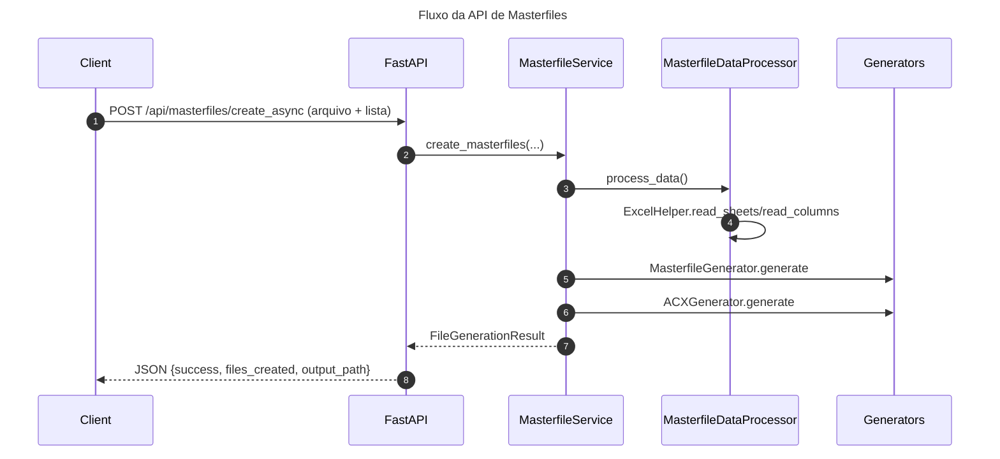

# 📐 Arquitetura do Projeto - Automation API

## 📊 Visão Geral

Este projeto implementa uma arquitetura em camadas, moderna e escalável, para automação de geração de Masterfiles, JSONs (Oracle/PostgreSQL) e modelos DBN (DBN0/DBN1), com frontends PyQt5 (desktop) e FastAPI (web/API).

## 🏗️ Arquitetura em Camadas

┌───────────────────────────────────────────────────────────┐
│                   CAMADA DE APRESENTAÇÃO                  │
│───────────────────────────────────────────────────────────│
│  ┌──────────────────────┐      ┌──────────────────────┐   │
│  │   PyQt5 (desktop/)   │      │   FastAPI (src/api/) │   │
│  └───────────┬──────────┘      └──────────┬───────────┘   │
└──────────────┼────────────────────────────┼───────────────┘
               │                            │
               ▼                            ▼
┌───────────────────────────────────────────────────────────┐
│                   SERVICE LAYER (src/services/)           │
│───────────────────────────────────────────────────────────│
│  - MasterfileService    - JsonService    - DBNService     │
└───────────────────────────────────────────────────────────┘
               │
               ▼
┌───────────────────────────────────────────────────────────┐
│               DOMAIN LAYER (src/domain/processors/)       │
│───────────────────────────────────────────────────────────│
│  - MasterfileCreator      - JsonCreator                   │
│  - MasterfileDataProcessor - JsonDataProcessor            │
└───────────────────────────────────────────────────────────┘
               │
               ▼
┌───────────────────────────────────────────────────────────┐
│           INFRASTRUCTURE LAYER (src/infrastructure/)      │
│───────────────────────────────────────────────────────────│
│  generators/              │  repositories/                │
│  - MasterfileGenerator    │  - FileRepository             │
│  - ACXGenerator           │  - ExcelRepository            │
│  - JsonMontadorUnificado  │                               │
│  - DBNModel               │                               │
└───────────────────────────────────────────────────────────┘
               │
               ▼
┌───────────────────────────────────────────────────────────┐
│              UTILS & CORE (src/utils/, src/core/)         │
│───────────────────────────────────────────────────────────│
│  - ValidationHelper  - PathHelper  - ProgressHelper       │
│  - DatabaseHelper    - ExcelHelper - TextHelper           │
│  - Config (Pydantic Settings)  - Custom Exceptions        │
└───────────────────────────────────────────────────────────┘

## 📁 Estrutura de Diretórios

APP_Automation-refactor/
│
├── src/                              # Código fonte principal
│   ├── __init__.py
│   │
│   ├── api/                          # FastAPI Application
│   │   ├── __init__.py
│   │   ├── main.py                   # Entry point da API
│   │   ├── dependencies.py           # Injeção de dependências
│   │   └── routes/                   # Rotas da API
│   │       ├── __init__.py
│   │       ├── masterfile_routes.py
│   │       ├── json_routes.py
│   │       └── dbn_routes.py
│   │
│   ├── core/                         # Configurações centrais
│   │   ├── __init__.py
│   │   ├── config.py                 # Settings (Pydantic BaseSettings)
│   │   ├── constants.py              # Constantes e enums
│   │   └── exceptions.py             # Exceções customizadas
│   │
│   ├── models/                       # Schemas Pydantic
│   │   ├── __init__.py
│   │   ├── requests.py               # Modelos de entrada
│   │   └── responses.py              # Modelos de saída
│   │
│   ├── services/                     # Lógica de negócio
│   │   ├── __init__.py
│   │   ├── base_service.py           # Classe base
│   │   ├── masterfile_service.py
│   │   ├── json_service.py
│   │   └── dbn_service.py
│   │
│   ├── domain/                       # Camada de domínio
│   │   ├── __init__.py
│   │   └── processors/               # Processadores de dados
│   │       ├── __init__.py
│   │       ├── masterfile_processor.py
│   │       ├── masterfile_data_processor.py
│   │       ├── json_criador.py
│   │       └── json_processa_dados_excel.py
│   │
│   ├── infrastructure/               # I/O e geradores
│   │   ├── __init__.py
│   │   ├── generators/               # Geradores de arquivos
│   │   │   ├── __init__.py
│   │   │   ├── masterfile_generator.py
│   │   │   ├── acx_generator.py
│   │   │   ├── json_montador_unificado.py
│   │   │   ├── modeloDBN0.py
│   │   │   ├── modeloDBN1.py
│   │   │   └── renomearDBN1.py
│   │   └── repositories/             # Acesso a dados/arquivos
│   │       ├── __init__.py
│   │       ├── interfaces.py
│   │       ├── file_repository.py
│   │       └── excel_repository.py
│   │
│   └── utils/                        # Utilitários
│       ├── __init__.py
│       ├── helpers.py                # Helpers compartilhados
│       ├── file_utils.py             # Utilitários de arquivo
│       └── response_models.py        # Modelos de resposta (dataclasses)
│
├── desktop/                          # App Desktop (PyQt5) - Separado
│   ├── __init__.py
│   ├── app.py                        # Entry point desktop
│   ├── view.py                       # Interface gráfica
│   ├── ui_adapter.py                 # Adaptador UI/Services
│   ├── alerta.py                     # Alertas desktop
│   └── icons/                        # Ícones
│
├── tests/                            # Testes
│   ├── __init__.py
│   ├── conftest.py                   # Fixtures pytest
│   ├── test_api/
│   │   └── test_health.py
│   └── test_services/
│       └── test_masterfile_service.py
│
├── docs/                             # Documentação
│   ├── API.md
│   ├── ARCHITECTURE.md
│   ├── DOCUMENTACAO_FUNCIONAL.md
│   └── DOCUMENTACAO_TECNICA.md
│
├── run.py                            # Entry point da API
├── requirements.txt                  # Dependências produção
├── requirements-dev.txt              # Dependências desenvolvimento
├── .env.example                      # Template de variáveis
├── .gitignore
└── README.md

## 🎯 Princípios Arquiteturais

### 1. **Separação de Responsabilidades**
Cada camada tem uma responsabilidade clara e bem definida.

### 2. **Desacoplamento de UI**
- Services não conhecem a UI
- Podem ser usados por PyQt5, FastAPI, CLI, etc.

### 3. **Testabilidade**
- Services podem ser testados sem UI
- Lógica isolada e modular

### 4. **Escalabilidade**
- Fácil adicionar novos frontends
- Fácil adicionar novos services

## 🔌 Múltiplos Frontends

O projeto suporta múltiplos frontends simultaneamente, sem acoplamento com a lógica de negócio:

- **PyQt5 (Desktop)**
- **FastAPI (Web/API)**
- **CLI** (futuro)

### PyQt5 (Desktop)
- **Entrypoint**: `app.py`
- **UI principal**: `view.py`
- **Integração com Services**: `ui_adapter.py` (classes `ServiceWorker` e `UIAdapter`) para usar `MasterfileService` e `JsonService` sem acoplar à UI.

Exemplo de uso direto dos services:
```python
from services import MasterfileService

service = MasterfileService()
result = service.create_masterfiles(
    path_excel="pack.xlsx",
    inventory_names=["INV_A", "INV_B"],
    db_type="postgres",
    output_path="MASTERFILES_pack"
)
### FastAPI (Web/API)
- **Entrypoint**: `api/main.py`
- **Documentação**: `/docs` (Swagger) e `/redoc`

Endpoints principais:
- **GET** `/` — status da API
- **GET** `/health` — health check
- **POST** `/api/masterfiles/create_async` — cria masterfiles (assíncrono, retorna `job_id`)
- **GET** `/api/masterfiles/progress/{job_id}` — progresso/resultado do job
- **POST** `/api/jsons/create_async` — cria JSONs (assíncrono, retorna `job_id`)
- **GET** `/api/jsons/progress/{job_id}` — progresso/resultado do job
- **POST** `/api/dbn/dbn0/create` — gera modelo de exportação DBN0
- **POST** `/api/dbn/dbn1/create` — gera modelo de exportação DBN1
- **POST** `/api/dbn/dbn1/rename` — renomeia arquivos DBN1 gerados

Rodando a API localmente:
```bash
uvicorn api.main:app --reload
```

### Diagrama de Camadas (Mermaid)
```mermaid
flowchart LR
  UI[PyQt5 View] --> SvcMF(MasterfileService)
  UI --> SvcJS(JsonService)
  API[FastAPI] --> SvcMF
  API --> SvcJS
  API --> SvcDBN(DBNService)

  SvcMF --> ProcMF[MasterfileDataProcessor (masterfile_data_processor)]
  SvcJS --> ProcJS[JsonDataProcessor (json_processa_dados_excel)]

  ProcMF --> Excel[ExcelHelper]
  ProcJS --> Excel
  Excel --> Repo[file_repository / excel_repository]

  SvcMF --> GenMF[MasterfileGenerator / ACXGenerator]
  SvcJS --> GenJS[JsonMontadorUnificado]
  SvcDBN --> GenDBN[ModeloDBN0 / ModeloDBN1]

  Helpers[helpers.py: Validation/Path/Progress/etc]
  Models[response_models.py / exceptions.py]
```

### Fluxo API Masterfiles (Mermaid)


## 🧩 Camadas e responsabilidades
- **Apresentação**: `app.py`, `view.py` (PyQt5), `api/` (FastAPI)
- **Service Layer**: `services/*` (validação, orquestração, progresso e retorno `FileGenerationResult`)
- **Domain**: `domain/processors/*` (processamento de dados do pack Excel)
- **Infrastructure**: `infrastructure/generators/*`, `infrastructure/repositories/*` (geração de artefatos e I/O)
- **Helpers e Models**: `helpers.py`, `response_models.py`, `exceptions.py`

## 🧪 Testes e qualidade
- **Teste de arquitetura**: `test_architecture.py` valida imports, helpers, services e configurações de DB.
- **Padrão de respostas**: `ProcessResult`, `ValidationResult`, `FileGenerationResult` (sem dependência de UI).

## ❗ Tratamento de erros e progresso
- **Exceções**: `exceptions.py` (`AutomationError`, `ValidationError`, `DuplicateError`, etc.).
- **Progresso**: `ProgressHelper` + `BaseService.current_progress` + endpoints `/progress/{job_id}`; processamento assíncrono via `BackgroundTasks` com registry em memória e limpeza automática (TTL).
- **Alertas (UI)**: `AlertsAdapter` abstrai `alerta.py` e usa logging como fallback.

## 📂 Saída e caminhos
- **API**: saída na raiz do projeto via `PathHelper.get_project_root()` com pastas únicas por execução: `MASTERFILES_<excel>_<timestamp>` e `JSON_<excel>`.
- **UI**: saída ao lado do pack via `utils.CreateAndDeleteFolder` (`MASTERFILES_*` / `JSON_*`).

## ⚙️ Execução rápida
- **Instalar dependências**: `pip install -r requirements.txt`
- **Rodar UI (desktop)**: `python desktop/app.py`
- **Rodar API (web)**: `python run.py` ou `uvicorn src.api.main:app --host 0.0.0.0 --port 8080 --reload`

## 🧭 Extensibilidade
- **Novos frontends**: reutilizam `services/*` sem mudar a lógica.
- **Novos bancos**: expandir `DatabaseHelper` e os geradores conforme necessário.
- **Novos artefatos**: criar novo service + generator e expor rota/ação na UI.

## 🔧 Requisitos e dependências
- **Core**: `numpy==2.3.2`, `pandas==2.3.2`, `python_calamine==0.5.3`
- **UI**: `PyQt5==5.15.11`, `PyQt5-Qt5==5.15.2`, `PyQt5_sip==12.17.0`
- **API**: `fastapi==0.115.0`, `uvicorn[standard]==0.32.0`, `python-multipart==0.0.12`
- **Utilitários**: `pydantic==2.9.2`, `python-dateutil==2.9.0.post0`, `pytz==2025.2`, `tzdata==2025.2`, `six==1.17.0`

## 🌐 Exemplos de chamadas da API

- **Criar Masterfiles (assíncrono)**
```bash
curl -X POST http://localhost:8080/api/masterfiles/create_async \
  -F "file=@/caminho/para/pack.xlsx" \
  -F 'inventory_names=["INV_A","INV_B"]' \
  -F "db_type=postgres"
# resposta: {"job_id": "<id>", "status": "accepted", "output_path": "..."}
```

- **Progresso por job_id**
```bash
curl "http://localhost:8080/api/masterfiles/progress/<id>"
```

- **Criar JSONs (assíncrono)**
```bash
curl -X POST http://localhost:8080/api/jsons/create_async \
  -F "file=@/caminho/para/pack.xlsx" \
  -F 'inventory_names=["INV_A","INV_B"]' \
  -F "db_type=oracle" \
  -F "is_parameter=true" \
  -F "is_enrichment=false"
```

- **Criar DBN0**
```bash
curl -X POST http://localhost:8080/api/dbn/dbn0/create \
  -F 'dbn_names=["DBN0_A","DBN0_B"]' \
  -F 'output_path=/caminho/saida' \
  -F 'schema=PUBLIC'
```

- **Criar DBN1**
```bash
curl -X POST http://localhost:8080/api/dbn/dbn1/create \
  -F 'dbn_names=["DBN1_A","DBN1_B"]' \
  -F 'output_path=/caminho/saida' \
  -F 'schema=PUBLIC' \
  -F 'classe=MinhaClasseLogica'
```

- **Renomear arquivos DBN1**
```bash
curl -X POST http://localhost:8080/api/dbn/dbn1/rename \
  -F 'path=/caminho/para/pasta'
```

## 🧾 Contrato de resposta (API)
Todas as rotas retornam um JSON padronizado baseado em `FileGenerationResult`:
```json
{
  "success": true,
  "message": "Masterfiles e ACX criados com sucesso! (N arquivos)",
  "files_created": ["/caminho/arquivo1"],
  "total_files": 1,
  "output_path": "/caminho/saida",
  "errors": null,
  "warnings": null
}
```
Em caso de erro, `success=false` e `errors` conterá detalhes.

## 📚 Documentação Funcional (para não-DEVs)
- Consulte o arquivo [DOCUMENTACAO_FUNCIONAL.md](./DOCUMENTACAO_FUNCIONAL.md) nesta pasta de documentação.

## 🪵 Logging
- `run.py` configura `logging.basicConfig(level=logging.INFO)`.
- Logs de exceções são tratados por `global_exception_handler` e retornados como JSON 500.